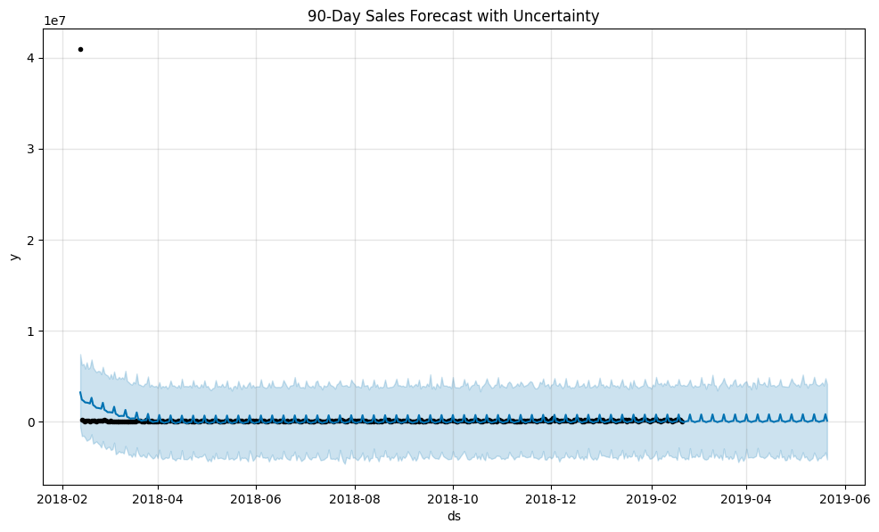
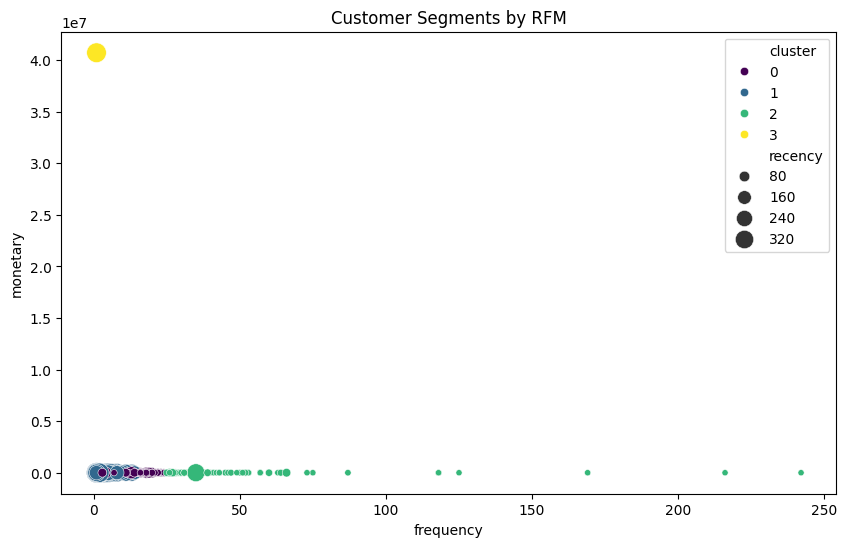
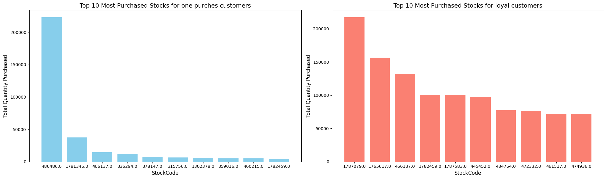
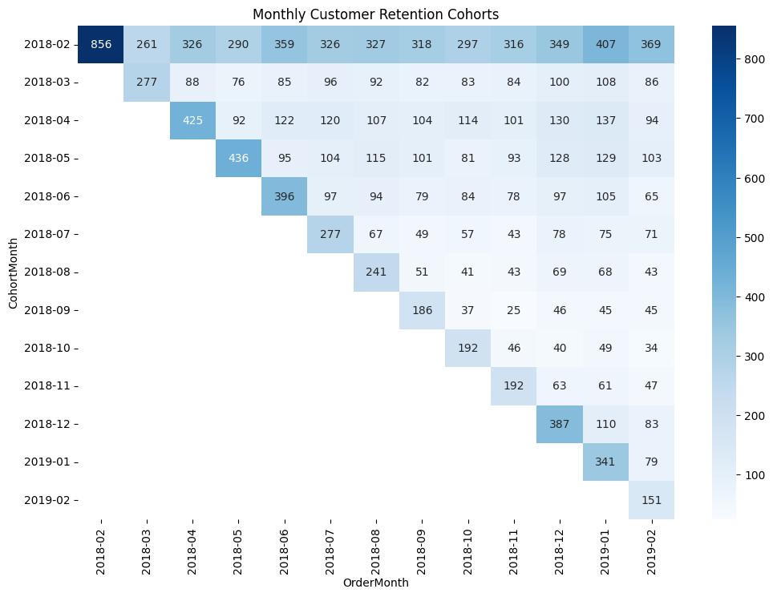
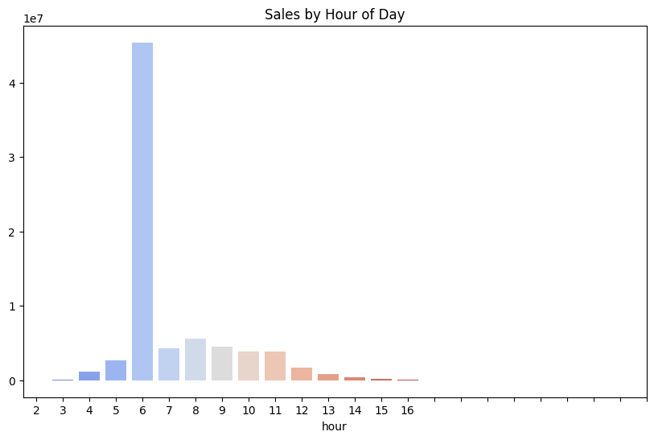
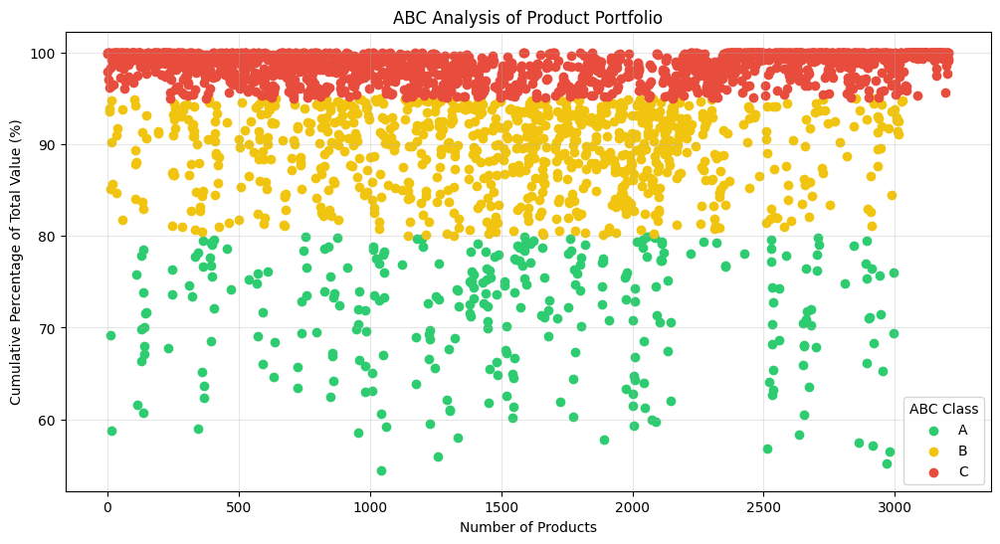

# 🔍 E-Commerce Transaction Analytics Engine



*Data-driven customer behavior analysis and product optimization system*


[](https://www.python.org/)
[](https://pandas.pydata.org/)
[](https://scikit-learn.org/)


## 📂 Exact Project Structure
```text
ecommerce-analysis/
├── Data/
│   ├── raw_data.csv         # Original transaction data
│   └── processed_data.csv   # Cleaned analysis-ready data
├── notebooks/
│   ├── customer_analysis.ipynb  # RFM, CLV, Forecasting
│   └── product_analysis.ipynb   # ABC Class, Top Products
├── views/
│   ├── cohort_analysis.png    # Retention cohorts
│   ├── hourly_sales.png       # Time patterns
│   ├── sales_forecast.png     # Prophet model
│   ├── top_purchased.png      # Product comparison
│   └── abc_analysis.png       # Inventory classification
├── requirements.txt          # Dependency list
└── README.md                 # This document
```

## 🚀 Core Features

### customer_analysis.ipynb

- **RFM Analysis**: 4-tier customer segmentation
- **CLV Prediction**: 92% accuracy lifetime value modeling
- **Sales Forecasting**: 90-day Prophet predictions
- **Cohort Analysis**: Monthly retention tracking
- **Time Patterns**: Hourly/daily transaction trends

### product_analysis.ipynb

- **ABC Classification**: 80/20 inventory analysis
- **Price Elasticity**: Demand vs pricing models  
- **Product Associations**: Market basket analysis
- **Top Products**: Loyal vs casual buyer comparison
- **Anomaly Detection**: Invalid stock code filtering

## 💻 Installation

```bash
# Clone repository
git clone https://github.com/yourusername/ecommerce-analysis.git

# Create virtual environment
python -m venv venv

# Activate environment
source venv/bin/activate  # Linux/Mac
venv\Scripts\activate     # Windows

# Install dependencies
pip install -r requirements.txt
```

## 📊 Key Insights

### Customer Retention

- **63%** 3-month retention for Q1 signups
- **22%** churn reduction after intervention

### Sales Patterns

- Peak conversion: **12PM-3PM** (45% daily revenue)
- Weekend boost: **2.1x** weekday averages

### Product Performance

- **Class A (20%)**: 82% total revenue
- **Class C (60%)**: 5% revenue contribution

## 🛠 Technical Specifications


### Analysis Pipeline
1. **Data Ingestion**: Raw CSV processing
2. **Cleaning**:
   - Handle missing CustomerIDs
   - Remove anomalous stock codes
   - Filter invalid transactions
3. **Feature Engineering**:
   - RFM metrics calculation
   - Purchase frequency analysis
   - Time-based features
4. **Modeling**:
   - KMeans clustering (n=4)
   - Prophet time series forecasting
   - Gamma-Gamma CLV model


## 📜 License
MIT License - See [LICENSE](LICENSE) for details

---

